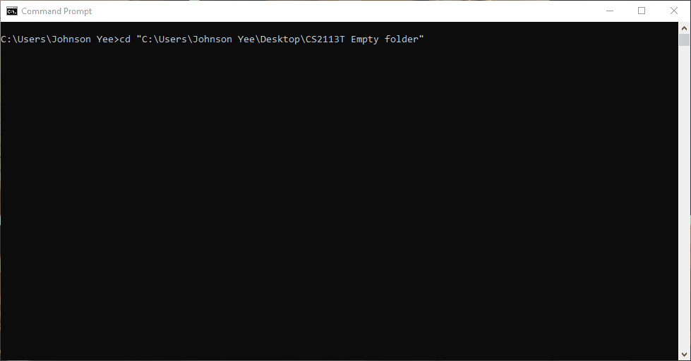

# User Guide
  ```
             ____        ____       
   __(")__  |  _ \ _   _|  _ \ ____ 
  (__   __) | | | | | | | | | | ___\
    /   \   | |_| | |_| | |_| |\ __/
   (_/ \_)  |____/ \__,_|\____/ \___|
  Sup! I'm Dude!
  What can a brother do for you?
```
Dude is your friendly task scheduler that is able to maintain a todo list and
schedule deadlines or events.
Dude is here to help a brother out!
* [Quick Start](#quick-start)
* [Features](#Features)
    + [1. Adding a Todo task: `todo`](#1-adding-a-todo-task-todo)
    + [2. Adding a Deadline task: `deadline`](#2-adding-a-deadline-task-deadline)
    + [3. Adding an Event task: `event`](#3-adding-an-event-task-event)
    + [4. Listing all tasks at hand: `list`](#4-listing-all-tasks-at-hand-list)
    + [5. Marking a task as complete: `done`](#5-marking-a-task-as-complete-done)
    + [6. Deleting a task: `delete`](#6-deleting-a-task-delete)
    + [7. Finding a task: `find`](#7-finding-a-task-find)
    + [8. Exiting the program: `bye`](#8-exiting-the-program-bye)
    + [9. Listing available help: `help`](#9-listing-available-help-help)
    + [10. Listing tasks due: `due`](#10-listing-tasks-due-due)
* [FAQ](#faq)
* [Command Summary](#command-summary)

## Quick Start

1. Ensure that you have Java `11` or above installed in your computer.
2. Download the latest `dude.jar` from [here](https://github.com/Johnson-Yee/ip/releases).
3. Copy the file to the folder you want to use as the _home folder_ for dude.jar task scheduler.
4. In command prompt, `cd` to the directory of the _home folder_.
5. Run the .jar file in the command prompt as follows: `java -jar dude.jar`
6. Type `help` to view commands available.
7. Refer to [Features](#features) below for details of each command

## Features 


>Notes about command format:  
>
>1. Words in **bold** are parameters to be provided by the user.
>2. Words in [] are optional parameters. 


### 1. Adding a Todo task: ```todo```
Adds a new Todo task to Dude. <br>
Format: <code>todo <strong>task</strong> </code> <br>
Example of usage: <code>todo <strong>CS2113T Week 7 pre-lecture quiz </strong></code><br>
Expected outcome: 
```
Got it. I've added this task:
  [T][✘] CS2113T Week 7 pre-lecture quiz
Now you have n tasks in the list.
```

### 2. Adding a Deadline task: ```deadline```
Adds a new Todo task to Dude. <br>
>To indicate date, '.' and '-' could be used in place of '/' eg. 28.05.2020 or 21/05/2020. <br>
To indicate time, ':' could be omitted eg. 1800. <br>
Note: The delimiter here is "**/by**", and it is compulsory to include it.
>
Format: <code>deadline <strong>task description /by DD/MM/YYYY [HH:mm]</strong></code> <br>
Example of usage: <code>deadline <strong>CS2113T iP Submission /by 03/10/2020 23:59</strong></code> <br>
Expected outcome: 
```
Got it. I've added this task: 
  [D][✘] CS2113T iP Submission  (by: Oct 03 2020 23:59)
Now you have n tasks in the list
```

### 3. Adding an Event task: ```event```
Adds a new Event task to Dude. <br>
>To indicate date, '.' and '-' could be used in place of '/' eg. 28.05.2020 or 21/05/2020. <br>
To indicate time, ':' could be omitted eg. 1800. <br>
Note: The delimiter here is "**/on**", and it is compulsory to include it.
>
Format: <code>event <strong>task description /on DD/MM/YYYY [HH:mm]</strong></code> <br>
Example of usage: <code>event <strong> Google Hackathon /on 27/10/2020 10:00</strong></code> <br>
Expected outcome: 
```
Got it. I've added this task: 
  [E][✘] Google Hackathon  (on: Oct 27 2020 10:00)
Now you have n tasks in the list
```

### 4. Listing all tasks at hand: ```list```
Lists all the current tasks at hand. <br>
Example of usage: <code>list</code> <br>
Expected outcome:
```
1.[T][✘] CS2113T Week 7 pre-lecture quiz
2.[D][✘] CS2113T iP Submission (by: Oct 03 2020 23:59)
3.[E][✘] Google Hackathon (on: Oct 27 2020 10:00)
```
### 5. Marking a task as complete: ```done```
Marks a user-specified task as done. <br>
>Note: Index keyed in must be within the range of 1 - n, where n is number of existing tasks. <br>

Format: <code>done <strong>index</strong></code> <br>
Example of usage: <code>done <strong>1</strong></code> <br>
Expected outcome:
```
Nice! I've marked this task as done: 
[✓] CS2113T Week 7 pre-lecture quiz
```

### 6. Deleting a task: ```delete```
Deletes a user-specified task. <br>
>Note: Index keyed in must be within the range of 1 - n, where n is number of existing tasks. <br>

Format: <code>delete <strong>index</strong></code> <br>
Example of usage: <code>done <strong>1</strong></code> <br>
Expected outcome:
```
Got it brother! I've removed this task: 
[T][✓] CS2113T Week 7 pre-lecture quiz
 Now you have n tasks in the list.
```

### 7. Finding a task: ```find```
Locates all instances of tasks that contains the user-specified keyword <br>
>Note: The search is case-insensitive eg. `cs2113t` will match `CS2113T` <br>
>
Format: <code> find <strong>CS2113T</strong></code> <br>
Example of usage: <code> find <strong> CS2113T </strong></code> <br>
Expected outcome:
```
Here are the matches found!
 1. CS2113T iP Submission (by: Oct 03 2020 23:59)
```

### 8. Exiting the program: ```bye```
Exits the program, triggering automatic saving of data <br>
Example of usage: <code>bye</code> <br>
Expected outcome:
```
Goodbye. Sad to see you leave!
 Hope to see you again soon!
```

### 9. Listing available help: ```help```
Lists a set of commands available to users <br>
Example of usage: <code>help</code> <br>
Expected outcome:
```
Here are the range of commands:
1.todo
 Command used to record impending tasks
 For "todo", kindly input in this format: *todo* *description*
.
.
.
9.help
 Command used to list all available commands
 No additional info needed!

```
### 10. Listing tasks due: ```due```
Lists all tasks due on a user-specified date <br>
>Note: use "today" to check tasks due today

Example of usage: <code>due <strong> 28/10/2020 </strong></code> or <code>due <strong> today </strong><br>
Expected outcome:
```
Here are the tasks due on the specified date!
 1. CS2113T iP Submissions (by: Oct 03 2020)

```

## FAQ
**Q:** The storage file is not created in the same folder as dude.jar. What shall I do?
>Do remember to ```cd  *directory of home folder*``` as stated in [Quick Start](#quick-start) point 4.  

**Q:** How do I rectify the problem of my ticks and crosses being displayed as `?`? <br>
Follow this 3-step rectification: <br>
>1.In command line, run ```Chcp 65001```. <br>
>2.To run .jar file, input ```java -Dfile.encoding=UTF-8 -jar filename.jar```. <br>
>3.In system settings of command prompt, change font to NSimSun


## Command Summary
>Note: No additional parameter is needed if it is not mentioned. eg help <br>

Action | Format | example
--- | --- | ---
todo | `todo` **task description** | `todo` **CS2113T Pre-lecture Quiz**
deadline | `deadline` **task description /by dd/mm/yyyy [HH:mm]** | `deadline` **Complete CS quiz /by 20-10-2020**
event | `event` **task description /on dd/mm/yyyy [HH:mm]** | `event` **Google Hackathon /on 26/10/2020 18:00**
list | `list` | `list`
done | `done` **task index** | `done` **1**
delete | `delete` **task index** | `delete` **2**
find | `find` **keyword** | `find` **cs2113t**
bye | `bye` | `bye`
help | `help` | `help`
due | `due` | `due` **dd/mm/yyyy** OR `due` **today**
